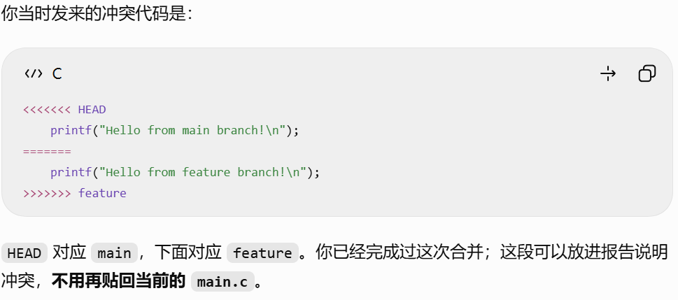

# Lab 0：Git 实验报告

姓名：10xmx012  
个人仓库：[https://github.com/10xmx012/-](https://github.com/10xmx012/-)  
实验环境：Windows、WSL Ubuntu、VS Code、Git、GitHub

## 一、实验目标与过程

本实验练习 Git 仓库、暂存与提交、分支、合并以及冲突解决。我先从课程提供的 GitLab 模板创建了自己的 GitHub 仓库，再将仓库克隆到 WSL Ubuntu 中，在 VS Code 中打开并修改 `main.c`。

我将 `main.c` 中的 TODO 改为实际内容后，使用 `git add main.c` 将修改加入暂存区，使用 `git commit -m "Complete main.c TODO"` 提交，得到提交 `0861fe0`。之后创建 `feature` 分支，分别在 `feature` 和 `main` 上修改 `main.c` 的同一行，并各自提交：`feature` 上的提交是 `502a06a Edit greeting on feature`，`main` 上的提交是 `4cc76b9 Edit greeting on main`。

在 `main` 分支运行 `git merge feature` 时，Git 报告 `main.c` 存在内容冲突。我查看冲突标记，手动编辑文件，删除标记并保留希望采用的程序内容，然后暂存并提交合并结果。最后一次检查中，`git status` 显示工作区干净，且 `main` 比 `origin/main` 超前 4 个提交；这说明当时本地操作已完成，但这些提交尚未推送到 GitHub。

## 二、思考题

### 1. 过去参加多人协作时采用了什么方法？

我之前没有参加过多人协作开发，因此没有实际使用过某种多人协作方法，也不能把本次实验写成真实的团队经验。通过这次实验，我理解了将来可以怎样开展协作：每个人从共同的仓库获取代码，在自己的分支修改并提交，再把修改合并回主分支。多人修改同一位置时可能出现冲突，解决冲突需要阅读双方的改动，确定最终版本，并与相关成员沟通。提交记录能够说明每次改动的内容和原因。

### 2. 为什么 Git 要分为 `git add` 和 `git commit` 两步？

`git add` 把选定的改动放入暂存区，决定下一次提交包含哪些内容；`git commit` 则把暂存区中的内容保存为一次有提交说明的历史记录。两步分开使我可以先检查和挑选改动，再把相关内容组成一个清晰的提交。例如，修改了代码和临时笔记时，可以只暂存需要提交的代码，避免把无关文件一起提交。如果暂存后又修改了文件，还需要再次 `git add`，新修改才会进入下一次提交。

### 3. `git branch` 与 `git branch -a` 有什么区别？

`git branch` 默认列出本地分支，例如本实验中的 `main` 和 `feature`，当前分支前会有 `*`。`git branch -a` 则列出本地分支以及本地记录的远程跟踪分支，例如 `remotes/origin/main`。远程跟踪分支表示本地上次获取到的远程状态；运行 `git fetch` 后，列表和对应位置才会更新。因此，`-a` 表示显示所有这些可见的分支，而不意味着自动下载远程仓库的最新内容。

## 三、选读材料与学习体会

### 材料一：Commit message 和 Change log 编写指南

材料地址：[阮一峰《Commit message 和 Change log 编写指南》](https://www.ruanyifeng.com/blog/2016/01/commit_message_change_log.html)。这篇文章介绍了提交说明的作用：清楚的提交说明有助于浏览历史、查找特定类型的改动，还可以辅助生成变更日志。文章给出一种提交信息格式，以 `type`、可选的 `scope` 和简短的 `subject` 描述提交；例如 `feat` 表示新功能，`fix` 表示问题修复，`docs` 表示文档修改。

我的理解是，一次提交应尽量对应一个明确的修改目的，提交说明要让之后查看历史的人读懂改了什么。本实验使用的 `Complete main.c TODO`、`Edit greeting on feature` 等说明可以对应到具体步骤；今后写更复杂的项目时，还可以根据项目约定使用统一格式。

### 材料二：语义化版本 2.0.0

材料地址：[语义化版本 2.0.0 中文版](https://semver.org/lang/zh-CN/)。语义化版本通常采用 `主版本号.次版本号.修订号` 的形式。公共 API 出现不兼容修改时增加主版本号；向下兼容地增加功能时增加次版本号；向下兼容地修复问题时增加修订号。这样的版本号让使用者从版本变化中判断升级可能带来的影响。

我的理解是，Git 的提交回答“代码是怎样一步步改动的”，版本号则帮助别人理解一次发布与之前相比有多大变化。这个小实验没有发布公共 API，所以不需要给 `main.c` 强行加版本号，但可以从中理解规范记录改动的价值。

### 为什么需要学习 Git？

Git 可以记录代码的修改历史，让我回顾每一步改动；分支允许我在不直接影响主分支的情况下尝试新修改；合并使不同分支的成果汇集到一起。即使只有一个人写代码，这些能力也能帮助定位错误、整理工作和保留可回退的版本。将来参加多人项目时，提交、分支、合并和冲突处理更是协作的基础。

## 四、合并冲突及解决

为了实际体验冲突，我在两个分支修改了 `main.c` 的同一行。在 `main` 上运行 `git merge feature` 后，终端显示：

```text
Auto-merging main.c
CONFLICT (content): Merge conflict in main.c
Automatic merge failed; fix conflicts and then commit the result.
```

当时文件中的冲突片段为：

```c
<<<<<<< HEAD
    printf("Hello from main branch!\n");
=======
    printf("Hello from feature branch!\n");
>>>>>>> feature
```

`<<<<<<< HEAD` 到 `=======` 是当时 `main` 分支的内容，`=======` 到 `>>>>>>> feature` 是准备合并进来的 `feature` 分支内容。Git 无法仅凭文件内容确定应该采用哪一个版本，因此我手动处理冲突，删除 `<<<<<<<`、`=======`、`>>>>>>>` 标记，只留下有效的 C 代码，再将解决结果暂存并提交。合并后检查显示 `nothing to commit, working tree clean`，说明这次冲突解决已经形成提交，工作区没有未提交的改动。



图 1：聊天记录中保存的合并冲突代码及说明。

## 五、实验总结

本实验让我把“工作区修改 → 暂存 → 提交 → 分支修改 → 合并 → 解决冲突”串成了一次完整操作。我遇到的主要问题包括 WSL 中访问 GitHub 失败、VS Code 工作区没有打开正确的文件夹，以及 Git 首次提交需要设置作者身份。逐一排查后，我能够在正确的仓库目录操作，并理解 Git 状态信息所描述的是本地提交与远程仓库之间的关系。最后仍需将报告加入仓库、推送 `main`，并在课程平台提交个人仓库链接。
